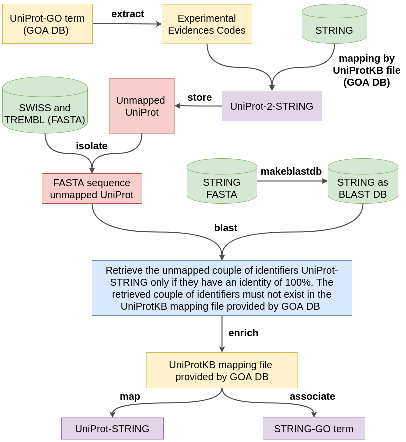

# GO data pipeline

This repository contains the source code to build datasets to use for the GO terms prediction for a pool of organisms.

## Table of Contents
<pre>
<a href="#overview">Overview</a>
<a href="#requirements">Requirements</a>
<a href="#download-data">Download data</a>
    <a href="#go-graph">GO graph</a>
    <a href="#uniprot-fasta">UniProt fasta</a>
    <a href="#network-and-annotation">Network and Annotation</a>
<a href="#call-the-pipeline">Call the pipeline</a>
<a href="#build-dataset-for-a-cross-validation-procedure">Build dataset for a cross-validation procedure</a>
<a href="#build-dataset-for-a-time-split-hold-out-procedure">Build dataset for a time-split hold-out procedure</a>
<a href="#license">License</a>
</pre> 

## Overview

The main goal of the pipeline depicted in Fig.1, is to limit as much as possible the number of the unmapped identifiers for the couple UniProt-AC towards STRING-ID in the UniProtKB mapping file provided by the GOA database. The most time-consuming step of the pipeline, is the part where we isolate the FASTA sequences of the unmapped UniProt-AC identifiers from the TREMBL database (22Gb zipped). It is worth noting that some of the retrieved proteins might be lost during the construction of the annotations matrix, since such proteins might be *singleton* in the corresponding STRING network.

<p align="center">
    <br><br>Fig.1. GO data workflow.
</p>


## Requirements

The pipeline must be executed in a UN\*X system and the following Perl modules and R packages (and their corresponding dependencies) as well as the BLAST+ toolkit must be installed.

- Perl modules:

    * obogaf::parser.: parse raw obo and gaf file (<a href="https://obogaf-parser.readthedocs.io" target="_blank">link</a>);
    * Time::HiRes: compute the elapsed time (<a href="https://metacpan.org/pod/Time::HiRes" target="_blank">link</a>);

- R libraries: 

    * HEMDAG: parse graph and to build dataset (<a href="https://hemdag.readthedocs.io" target="_blank">link</a>);
    * optaparser: command line parser (<a href="https://CRAN.R-project.org/package=optparse" target="_blank">link</a>);


- BLAST+ toolkit:

    To install the standalone BLAST+ toolokit follow the instruction at this <a href="https://www.ncbi.nlm.nih.gov/books/NBK52640/" target="_blank">link</a>. At the end do not forget to set the BLAST path on your ``~/.bashrc`` file:

    ```
    export PATH="<path_to>/blast/ncbi-blast-#.#.#+/bin:$PATH"
    ```

    where ``#.#.#`` represents the version number of the downloaded release. 

    > NOTE: we run the pipeline by using the BLAST+ toolkit ``ncbi-blast-2.10.1+-x64-linux.tar.gz``, but later version should run without any problem.

## Download data

Before building the dataset according to the pipeline depicted in Fig.1, we need to download (for a given organism) the GO graph, the protein-protein (p2p) network and the annotation table.

### GO graph

To download and build the latest version of a GO graph:

```
cd go_obo/
bash make_graph.sh > make_graph.out 2> /dev/null &
```

After around few minutes (about 5/10 minutes), the full graphs of each GO domain (BP, MF, CC) are stored both as plain text files and as objects of class ``graphNEL`` (``.rda`` files).

### UniProt fasta

To download the latest Swiss and TrEMBL fasta sequence from UniProKB:

```
mkdir uniprot
cd uniprot/
wget ftp://ftp.uniprot.org/pub/databases/uniprot/current_release/knowledgebase/complete/uniprot_sprot.fasta.gz
wget ftp://ftp.uniprot.org/pub/databases/uniprot/current_release/knowledgebase/complete/uniprot_trembl.fasta.gz
```

> This files are used later to retrieve the unmapped couple of identifiers UniProt-STRING with an identity of 100%. 
> NOTE: TrEMBL fasta sequence is a large file (about 22Gb)

### Network and Annotation

To download the **most recent version** of the STRING p2p network and of the annotation file of a specified organism:

```
cd build_data/
perl download_data.pl <taxon> <org> <com> <release> <stringv> > download_data.out &
```

where:

* ``<taxon>``: NCBI taxonID. It can be one of the following value: ``3702, 6239, 9031, 7955, 44689, 7227, 9606, 10090, 10116, 559292``;

* ``<org>``: the organism identification code of at most 5 alphanumeric characters used as entry species name in the UniProtKB database. It can be one of the following: ``arath, caeel, chick, danre, dicdi, drome, human, mouse, rat, yeast``;

* ``<com>``: common organism name. It can be one of the following: ``arabidopsis, worm, chicken, zebrafish, dicty, fly, human, mouse, rat, yeast``;

* ``<release>``: date of the **latest** release of the gene annotation file and of the corresponding UniProtKB identifier mapping file. It can be written in the following format: ``<DD><MMM><YY>`` (eg: 12jan20);

* ``<stringv>``: the **latest** release version of the STRING database as reported at the [link](https://string-db.org/cgi/access.pl?footer_active_subpage=archive). It can be written in the following format: ``v<string.version>`` (eg: v11.0);

> NOTE: ``<taxon>``, ``<org>`` and ``<com>`` parameters must be related, then the following combinations are possible:
>```
> 3702 arath arabidopsis
> 6239 caeel worm
> 9031 chick chicken
> 7955 danre zebrafish
> 44689 dicdi dicty
> 7227 drome fly
> 9606 human human
> 10090 mouse mouse
> 10116 rat rat
> 559292 yeast yeast
>```

More precisely, ``download_data.pl`` downloads (for a given organism) the following data:

1. STRING p2p interaction network and the corresponding fasta sequence (from STRING database);
1. protein-GO terms annotations from GOA database (annotations are provided as UniProtID);
1. identifier mapping file from GOA database to map the UniProtKB-AC versus the STRING identifiers;

and stores them in ``../orgs_data/<taxon>_<org>``. For instances the command:

```
perl download_data.pl 6239 caeel worm 16jun20 v11.0 > download_data.out &
```

downloads and stores all the files specified above in the folder ``../orgs_data/6239_caeel/``.


## Build dataset

The main scripts used to make dataset are the following:

* ``call_pipe.pl``: [run the pipeline illustrated in Fig.1](#call-the-pipe)
* ``make_timesplit_data.pl``: [build dataset for a time-split procedure](#build-dataset-for-a-time-split-hold-out-procedure);
* ``make_cv_data.R``: [build dataset for a cross validation procedure](#build-dataset-for-a-cross-validation-procedure);

## Call the pipeline

The pipeline depicted in [Fig.1](#overview) is called in the script ``call_pipe.pl``. This script maps the annotation from UniProtAC to STRING-ID by using the mapping file provided by GOA database and by limiting as much as possible the number of the unmapped identifiers. To this end the script blasts the unmapped identifiers against Swiss and Trembl database by recovering the identifiers having 100% of similarity with the condition that the couple of retrieved identifiers must not exist in the mapping file provided by GOA db. For more details on the sequence's length of the retrieved couple of identifiers, refer to the scripts in ``./build_data/blast_check/``. Anyway, it is worth noting that, the final goal of this pipeline is to build the full STRING p2p network and the matrix of the most specific annotation, minimizing the number of unmapped identifiers STRING-UniProt and consequently the number of GO terms.

To call the whole pipeline just type:

```
cd build_data/
perl call_pipe.pl <taxon> <org> <release> <stringv> > call_pipe.out 2> log &
```

where the inputs arguments are the same described in [Network and Annotation](#network-and-annotation).

The script ``call_pipe.pl`` automatically stores all the data in ``../orgs_data/<taxon>_<org>``. For instances, the command:

```
perl call_pipe.pl 6239 caeel 16jun20 v11.0 > call_pipe.out 2> log &
```

builds and stores data in the ``../orgs_data/6239_caeel/`` folder.  The script returns several intermediate files (names are self-explanatory), but the main ones are those with ``.rda`` extension:

* ``<taxon>_<org>_string_<stringv>.rda``: STRING p2p network; 
* ``<taxon>_<org>_spec_ann_<release>.rda``: matrix of the most specific annotations;

> NOTE: basic statistics as well as various info on the pipeline's steps are stored in the file ``call_pipe.out``.

> NOTE: the blast of unmapped identifiers against Trembl database can take up to 2/3 hours.

## Build dataset for a cross-validation procedure
To build the graph and the annotation matrix with regarding to the STRING network returned by ``call_pipe.pl`` we must call the R script ``make_cv_data.R``: 

```
Rscript make_cv_data.R -t <taxon> -o <org> -g <release> -s <stringv>
```

where the inputs arguments are described in [Network and Annotation](#network-and-annotation). 

> NOTE: in the script ``make_cv_data.R`` the input arguments are parsed by using the library ``optparse``:

The script ``make_cv_data.R`` automatically stores the data in ``../orgs_data/<taxon>_<org>``. For instances, the command:

```
Rscript make_cv_data.R -t 6239 -o caeel -g 16jun20 -s v11.0 > make_cv_data.out 2> log &
```

builds and stores the data in ``../orgs_data/6239_caeel/`` folder. The script returns intermediate files, but the main ones are those with an `.rda` extension. More precisely, the script returns for each GO domain (BP, MF, CC) the following files:

1. graph ``g``: ``<taxon>_<org>_go_<onto>_dag_<release>.rda``;
1. annotation matrix ``M``: ``<taxon>_<org>_go_<onto>_ann_<release>.rda``;

where: 

1. ``g`` is the DAG representing the hierarchy of the classes as an object of class ``graphNEL``;
1. ``M`` is the ``m x n`` annotation matrix, where ``m`` is the number of proteins an ``n`` is the number of classes/GO terms. The annotations are close by transitive closure. `M[i,j] = 1` means that the protein `i` is annotated with the term `j`, `M[i,j] = 0` means that the protein `i` is not annotated with the term `j`;

> NOTE: The number of proteins of ``M`` is the same of the weighted adjacency matrix stored in ``<taxon>_<org>_string_<stringv>.rda``.

The script ``make_cv_data.R`` has also the flag ``-f / --filter`` that can be used to "narrow" the STRING network only to those proteins having at least one annotation with a GO term. In this case the script returns, for each GO domain, the annotation matrix ``M`` and the STRING network ``W`` with only the annotated proteins as well as the graph ``g``.


## Build dataset for a time-split hold-out procedure 

To build dataset for a time-split hold-out procedure, the minimum data required are the GOA annotation files of two different release, i.e. the file of a **recent** annotations and the file of an **historical** annotations. To obtain this two files it is enough to run the script ``call_pipe.pl`` by using two different release of the GOA annotation file.

> NOTE: for historical and recent annotations this pipeline refers to two different release of STRING network, respectively the release 10.5 and 11.0. Since from STRING v10.5 to STRING v11.0 some identifiers changed, than the script ``map_string_v10-v11.pl`` maps the protein identifiers between the two STRING releases by using the mapping file providing by the STRING database. Then before building time-split dataset we must download the STRING mapping file and extract the data for the organism(s) of interest: 

```
mkdir -p ../orgs_data/string_map
cd ../orgs_data/string_map
wget https://string-db.org/mapping_files/STRING_v10.x_version_mapping/all_organisms.v10_v11.tsv.gz
zegrep '^<taxon>' all_organisms.v10_v11.tsv.gz | gzip -9 > goexp_orgs_v10_v11.tsv.gz
```

where `<taxon>` is one of the taxon shown in [Network and Annotation](#network-and-annotation). To extract more taxons use `|`, for instances:

```
zegrep '^6239|^9031|^7955|^7227|^9606|^10090' all_organisms.v10_v11.tsv.gz | gzip -9 > goexp_orgs_v10_v11.tsv.gz
```

Finally to build the time-split dataset just type:

```
perl make_timesplit_data.pl <taxon> <org> <historical> <recent> <stringv-historical> <stringv-recent> > make_timesplit_data.out 2> log &

```

where `<taxon>` and `<org>` are the same of those shown in [Network and Annotation](#network-and-annotation), whereas `<historical>`, `<recent>`, `<stringv-historical>`, `<stringv-recent>` refer respectively to the historical and recent release of the GOA annotation file and the STRING release:


The script ``make_timesplit_data.pl`` automatically stores the data in ``../orgs_data/<taxon>_<org>``. For instances, the command:

```
perl make_timesplit_data.pl 6239 caeel 20dec17 16jun20 v10.5 v11.0 > make_timesplit_data.out 2> log &
```

builds and stores the data in ``../orgs_data/6239_caeel/`` folder.  The script returns intermediate files (names are self-explanatory), but the main ones are those with an `.rda` extension. More precisely, the script returns for each GO domain (BP, MF, CC) the following files:

1. graph ``g``: ``<taxon>_<org>_go_<onto>_dag_<stringv-recent>_<historical>_<recent>.rda``;
1. annotation matrix ``M``: ``<taxon>_<org>_go_<onto>_ann_<stringv-recent>_<historical>_<recent>.rda``;
1. STRING p2p network ``W``: ``<taxon>_<org>_go_<onto>_string_<stringv-recent>_<historical>_<recent>.rda``;
1. testindex ``t``: ``<taxon>_<org>_go_<onto>_testindex_<stringv-recent>_<historical>_<recent>.rda``;

where: 

1. ``g`` is the DAG representing the hierarchy of the classes as an object of class ``graphNEL``;
1. ``M`` is the `m x n` annotation table containing the annotations of both training set (historical) and test set (recent). `m` are the number of examples/proteins and `n` are the number of classes/GO terms. The annotations are close by transitive closure. `M[i,j] = 1` means that the protein `i` is annotated with the term `j`, `M[i,j] = 0` means that the protein `i` is not annotated with the term `j`;
1. ``W`` is the `m x m` STRING p2p network. The matrix `W` is symmetric and scores are normalized in the interval `[0, 1]`, since by default it ranges between zero and one-thousand. 
1. ``t`` is the vector of integer number representing the index of the proteins of the test set (recent).


## License

This pipeline is distributed under the Perl5 license. Please see the [LICENSE](LICENSE) file for the complete version of the license.

